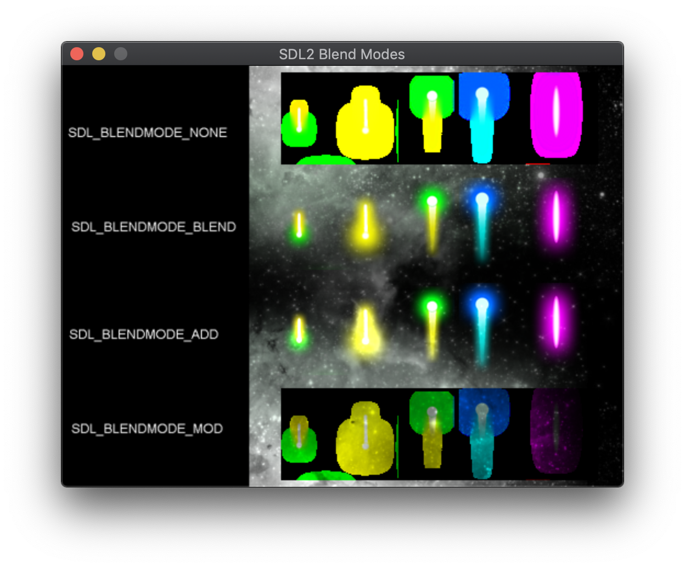

# sdl2-blendmodes
A demo project showing SDL2's texture blend modes
https://wiki.libsdl.org/SDL_SetTextureBlendMode

[beams.png](https://opengameart.org/content/lasers-and-beams) by [Rawdanitsu](https://opengameart.org/users/rawdanitsu)
http://creativecommons.org/publicdomain/zero/1.0/

[space_background_asteroid.png](https://opengameart.org/content/space-background-asteroid) by [code32](https://opengameart.org/users/code32)
http://creativecommons.org/publicdomain/zero/1.0/
